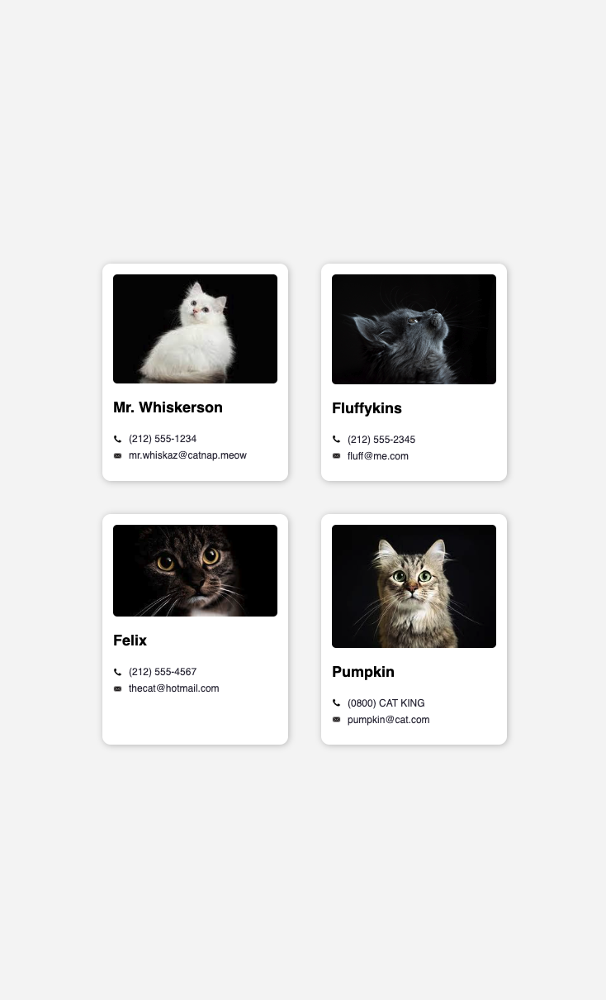

# React Cat Contacts

React Cat Contacts was a fun exercise to practice React.js. Webpage displays a photo of cat, their name, phone number and email address. Webpage looks something like this: 

# Next Steps
- Make each card component reusable by implementing props

